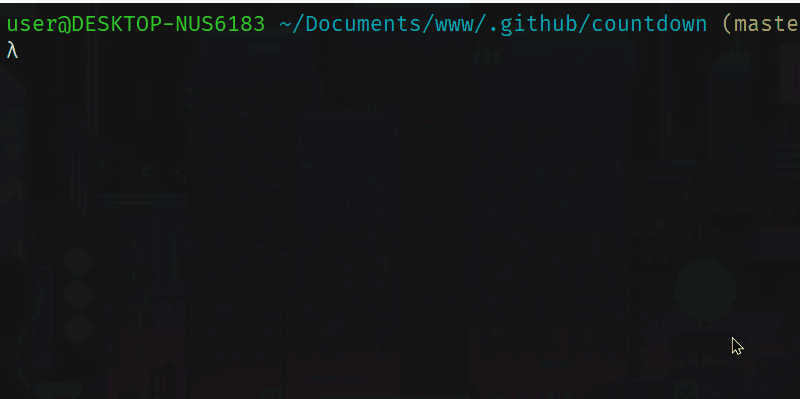

# Countdown

## Description

Application created using electronJS, 
which creates a countdown on the user's screen, 
to remind him to do something.



#

## Tech's

  - **ElectronJS** :large_blue_circle:.

## Get started

1 - Install the necessary dependencies

```bash
  npm install
```
or 
 
```bash
  yarn install
```
 
2 - Run the command to start the CLI

```bash
  npm run start
```

or 

```bash
  yarn start
```
